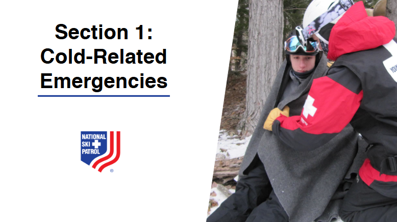
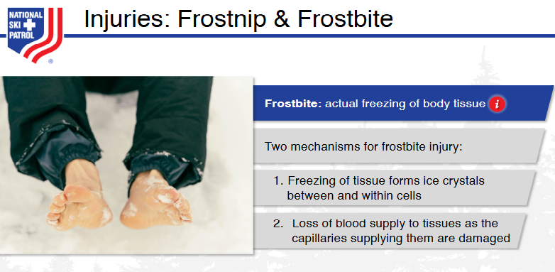
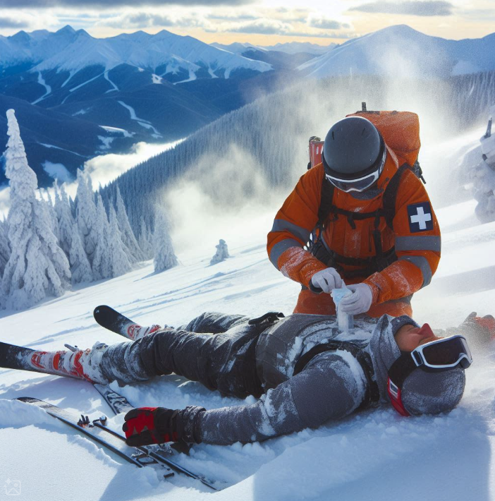
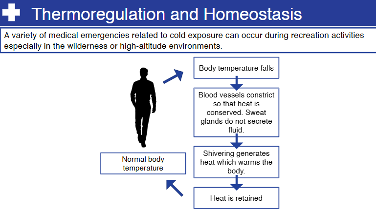

    
# Nsp Oec Training Chapter 25 

## National Ski Patrol - Outdoor Emergency Care chapter 25

    

    

## Chapter 25: Cold-Related Emergencies

1. Explain the wind chill index and how it applies to temperature.
2. List the signs and symptoms of frostnip and frostbite.
3. Explain the two types of hypothermia.
4. Define afterdrop.
5. Describe the assessment of a patient with cold injuries.  
6. Describe the four categories of cold exposure.
7. Demonstrate the management of a patient with cold injuries. 
8. Describe and demonstrate the emergency care of an avalanche victim. 

## 25.1 Explain the wind chill index and how it applies to temperature.

The wind chill index measures how cold it feels on exposed skin when the wind is factored in with the actual air temperature. Wind increases the rate of heat loss from the body, making it feel colder than the actual temperature. This index helps indicate the perceived temperature, especially during cold and windy conditions.

## 25.2 List the signs and symptoms of frostnip and frostbite.

### **Signs and Symptoms of Frostnip**:
- **Skin Color**: Pale or red skin.
- **Cold, Numb, or Tingling Sensation**: Affected area feels cold, numb, or may have a prickling sensation.
- **Soft Skin**: Skin remains soft and flexible.
- **Temporary Changes**: Symptoms are usually mild and reversible with warming, without lasting tissue damage.

### **Signs and Symptoms of Frostbite**:
- **Skin Color**: White, grayish-yellow, or blue skin; severe cases may turn black.
- **Cold, Hard, and Waxy Skin**: Affected area becomes hard and feels waxy to the touch.
- **Numbness and Pain**: Numbness, loss of sensation, and pain, which may stop as the damage progresses.
- **Blisters and Swelling**: Blisters may form, and the skin can swell; severe frostbite can cause permanent tissue damage or loss.

## 25.3 Explain the two types of hypothermia.

The two types of hypothermia are **acute** and **chronic hypothermia**:

1. **Acute Hypothermia**: Occurs when the body temperature drops rapidly over a short period, often due to sudden exposure to cold water or extreme cold weather. The body doesn’t have enough time to adjust, leading to a quick loss of heat.

2. **Chronic Hypothermia**: Develops gradually over a longer period, usually due to prolonged exposure to cold environments, such as staying in a cold, unheated home. It can be more common in vulnerable populations, such as the elderly, and often results from lower, sustained heat loss.

## 25.4 Define afterdrop.

**Afterdrop** is a phenomenon where the body’s core temperature continues to drop even after a person has been removed from a cold environment and rewarming has begun. This occurs because cold blood from the extremities returns to the core, mixing with the warmer blood and lowering the core temperature further. It can be dangerous and complicates the treatment of hypothermia.

## 25.5 Describe the assessment of a patient with cold injuries.  

Assessing a patient with cold injuries involves a systematic approach to determine the severity of the condition and identify any immediate threats to life. Here are the key steps:

### 1. **Scene Safety and Precautions**
   - Ensure the **environment is safe** for both the patient and rescuers, and move the patient to a **warm, sheltered area** if possible.
   - **Initiate standard precautions** (e.g., gloves, blankets) to avoid further heat loss.

### 2. **Initial Assessment (ABCs)**
   - **Airway**: Check if the airway is open and clear.
   - **Breathing**: Assess for slow, shallow, or irregular breathing, and monitor for signs of respiratory distress.
   - **Circulation**: Check the pulse; it may be **weak, slow, or irregular** in hypothermic patients. Address any signs of **shock** or severe hypothermia immediately.

### 3. **Vital Signs Monitoring**
   - **Temperature**: Measure the core body temperature, if possible, using a low-reading thermometer. Note if the patient’s temperature is **below 35°C (95°F)**, which indicates hypothermia.
   - **Heart Rate and Blood Pressure**: Expect a **slow heart rate** and possibly low blood pressure. Monitor continuously, as hypothermic patients are at risk of cardiac arrhythmias.

### 4. **Skin Assessment**
   - **Color and Condition**: Check for skin that is **pale, bluish, or waxy**, indicating cold injuries like frostbite or frostnip.
   - **Texture and Warmth**: Assess whether the skin feels **hard, cold, or numb**, which may signify frostbite.
   - **Presence of Blisters**: Blisters may indicate more severe frostbite, and black or necrotic tissue suggests deep tissue damage.

### 5. **Level of Consciousness (Mental Status)**
   - **Assess Orientation**: Check if the patient is alert and oriented, or if they are **confused, drowsy, or unresponsive**.
   - **Monitor for Signs of Severe Hypothermia**: Severe hypothermia may present with **slurred speech, disorientation, and loss of coordination**.

### 6. **Exposure and Detailed Physical Exam**
   - **Remove Wet Clothing**: Gently remove any wet clothing to prevent further cooling, but avoid aggressive movements to minimize the risk of triggering cardiac arrhythmias.
   - **Check the Extremities**: Inspect fingers, toes, ears, and nose for signs of frostbite or frostnip, such as **pale or discolored, hard, and numb tissue**.

### 7. **Assess for Afterdrop Risk**
   - Be aware of the possibility of **afterdrop** during rewarming, where cold blood from the extremities returns to the core, causing a further drop in core temperature.

Proper assessment is crucial for identifying the type and severity of cold injuries and guiding appropriate treatment, such as rewarming strategies, protecting from further heat loss, and managing potential complications.

## 25.6 Describe the four categories of cold exposure.

1. **Mild Hypothermia**: Body temperature drops to **32-35°C (90-95°F)**, causing shivering, cold extremities, and mild confusion.  
2. **Moderate Hypothermia**: Core temperature is **28-32°C (82-90°F)**, leading to intense shivering, slurred speech, and reduced coordination.  
3. **Severe Hypothermia**: Temperature falls **below 28°C (82°F)**, with symptoms including loss of shivering, unconsciousness, and a dangerously slow heart rate.  
4. **Frostbite**: Localized tissue freezing that results in **hard, pale, numb** skin, which can progress to tissue damage if not properly treated.

## 25.7 Demonstrate the management of a patient with cold injuries. 

Managing a patient with cold injuries requires a systematic approach to safely rewarm the patient, address complications, and prevent further heat loss. Here are the steps:

### 1. **Ensure Scene Safety and Protect from Further Cold Exposure**
   - Move the patient to a **warm, sheltered environment** to prevent further heat loss.
   - **Remove wet clothing** and cover the patient with **dry, warm blankets** or coats. If available, use a warm sleeping bag or thermal blanket.

### 2. **Initial Assessment (ABCs)**
   - **Airway**: Ensure the airway is clear and maintain open if necessary.
   - **Breathing**: Monitor for **slow, shallow, or irregular breathing**. Provide supplemental **oxygen** if available.
   - **Circulation**: Check the pulse, which may be slow or weak, and begin **CPR** if there is no pulse. Avoid vigorous movements that may lead to cardiac arrhythmias.

### 3. **Rewarming Strategies**
   - **Mild Hypothermia**: Use **passive rewarming** (covering with blankets, dry clothing, warm environment) and **warm, sweet drinks** if the patient is conscious and able to swallow.
   - **Moderate to Severe Hypothermia**: Use **active rewarming** techniques, including **warm blankets**, **warm water bottles**, or **heating pads** placed on the core areas (neck, chest, armpits, groin). Avoid direct heat on extremities to prevent afterdrop.
   - **Handle Gently**: Move the patient carefully, as rough handling can trigger dangerous heart rhythms.

### 4. **Management of Frostbite**
   - **Do Not Rub or Massage** the affected areas, as this can cause further tissue damage.
   - **Warm the Frostbitten Area** using **warm water (37-39°C or 98-102°F)** for 15-30 minutes until the skin becomes soft and pink. Avoid dry heat, such as heating pads or fires.
   - **Protect Blisters**: If blisters are present, **do not burst them**. Lightly bandage the area to prevent infection and tissue damage.

### 5. **Monitor and Support Vital Signs**
   - Continuously monitor **vital signs** (heart rate, blood pressure, respiratory rate, oxygen levels).
   - **Administer fluids**: Warm, non-alcoholic, non-caffeinated fluids orally if the patient is alert, to help rehydrate and warm from within.
   - **Check Level of Consciousness**: Watch for changes in **mental status**, which may indicate worsening hypothermia or other complications.

### 6. **Prepare for Transport if Necessary**
   - **Severe Cases**: For patients with severe hypothermia or significant frostbite, arrange for **immediate transport** to a hospital.
   - **Continue Warming Efforts** during transport, and keep the patient **as warm and still as possible**.

### 7. **Prevent Afterdrop and Monitor During Rewarming**
   - Be vigilant for signs of **afterdrop**, where cold blood from extremities lowers the core temperature. This can occur during rewarming and requires careful observation.
   - Avoid **alcohol** or **caffeine**, as these can cause vasodilation, increasing heat loss.

Proper management involves preventing further heat loss, safely rewarming, and monitoring for complications to ensure a stable recovery.

## 25.8 Describe and demonstrate the emergency care of an avalanche victim. 

Emergency care for an avalanche victim requires prompt action to address critical threats, including hypothermia, suffocation, and trauma. Here are the steps to describe and demonstrate the appropriate care:

### 1. **Scene Safety and Search**
   - **Ensure Scene Safety**: Before approaching, ensure the area is safe and that there is no risk of further avalanches. Be cautious of unstable snow and environmental hazards.
   - **Locate the Victim**: Use **avalanche beacons, probes, and visual clues** to locate the victim quickly. Speed is essential, as suffocation is a major concern within the first 15 minutes.

### 2. **Initial Assessment (ABCs)**
   - **Airway**: Clear snow from the victim’s mouth and nose to ensure a clear airway. Be prepared to begin **mouth-to-mouth resuscitation** if they are not breathing.
   - **Breathing**: Assess for breathing by looking, listening, and feeling. If there is no breathing, start **rescue breaths** and **CPR** if necessary.
   - **Circulation**: Check for a pulse. If no pulse is detected, begin **CPR** immediately and continue until emergency help arrives or the victim is revived.

### 3. **Gentle Extraction and Rewarming**
   - **Excavate Carefully**: Dig around the victim, starting from their head, to minimize further injury. Be gentle, especially if the victim is unresponsive, to prevent disturbing potential spinal injuries.
   - **Handle Gently**: Move the victim carefully to prevent afterdrop and cardiac arrhythmias if they are hypothermic. Avoid vigorous movements that might lead to sudden shifts in core temperature.
   - **Prevent Further Heat Loss**: Cover the victim with **blankets, warm clothing, or a survival bag** to minimize heat loss. If possible, place **warm water bottles** near the core (neck, chest, armpits, and groin).

### 4. **Rewarming Techniques**
   - **Passive Rewarming**: If the victim is conscious, use passive rewarming methods like **warm blankets, dry clothing, and creating a sheltered environment** to protect them from wind and cold.
   - **Active Rewarming**: For victims showing signs of moderate to severe hypothermia, use **warm compresses or heating pads** on the core areas (armpits, chest, neck, and groin). Avoid placing direct heat on extremities, as it may cause afterdrop.
   - **Oral Fluids**: If the victim is awake and can swallow, offer **warm, sweet, non-caffeinated liquids** to help increase core temperature.

### 5. **Ongoing Monitoring and Emergency Care**
   - **Monitor Vital Signs**: Continuously monitor the victim’s **breathing, heart rate, and level of consciousness**. Be alert for any signs of shock or respiratory distress.
   - **Check for Trauma**: Look for **visible injuries**, such as fractures, cuts, or bruises, and immobilize any suspected spinal or limb injuries to prevent further damage.
   - **Prepare for Transport**: Arrange for **emergency transport** as soon as possible. Continue monitoring and warming efforts during transport, and keep the victim as **still and warm** as possible.

### 6. **CPR Considerations for Hypothermic Victims**
   - **Continue CPR Longer**: Hypothermic victims can survive longer without oxygen, so continue CPR for an extended period until professional medical help arrives.
   - **Defibrillation**: If the victim is in cardiac arrest and a defibrillator is available, **attempt defibrillation**. Be prepared to administer multiple shocks, as hypothermia can make the heart less responsive.

### Summary:
1. **Scene Safety**: Ensure the area is safe and locate the victim quickly.
2. **Clear Airway and Assess Breathing**: Check ABCs, clear the airway, and start CPR if needed.
3. **Gentle Extraction**: Carefully dig out the victim and prevent further heat loss.
4. **Rewarming**: Use passive and active rewarming techniques, avoiding vigorous movements.
5. **Monitor and Manage Injuries**: Monitor vital signs, address injuries, and prepare for transport.

Proper and gentle handling, continuous rewarming, and prompt CPR can greatly improve the chances of survival for avalanche victims. Rapid response is crucial, as time is of the essence in preventing suffocation and severe hypothermia.

    

    
## Getting Started

The goal of this solution is to **Jump Start** your development and have you up and running in 30 minutes. 

To get started with the **Nsp Oec Training Chapter 25** solution repository, follow these steps:
1. Clone the repository to your local machine.
2. Install the required dependencies listed at the top of the notebook.
3. Explore the example code provided in the repository and experiment.
4. Run the notebook and make it your own - **EASY !**
    
## List of Figures
       
    

## Github https://github.com/JoeEberle/ - Email  josepheberle@outlook.com 
    

    